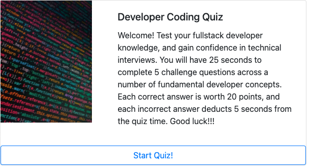

    
# Developer Coding Quiz

## License

## Description
    
Coding quiz created for aspiring developers to test their coding knowledge

## Screenshot

        

## Table of Contents

* [Usage](#usage)
* [Credits](#credits)
* [License](#license)
* [Tests](#tests)
* [Questions](#questions)
    

## Usage

After cloning, open the index.html from your code editor, and take the quiz.

## Credits

*[@coding-boot-camp](https://github.com/coding-boot-camp)

*[FullStack_Cafe](https://www.fullstack.cafe/interview-questions/javascript)

## Contributing

## Tests
no current test method

## Questions

Please send additional questions to [@coderjake91](https://github.com/coderjake91), email: jacob.b.frazer@gmail.com